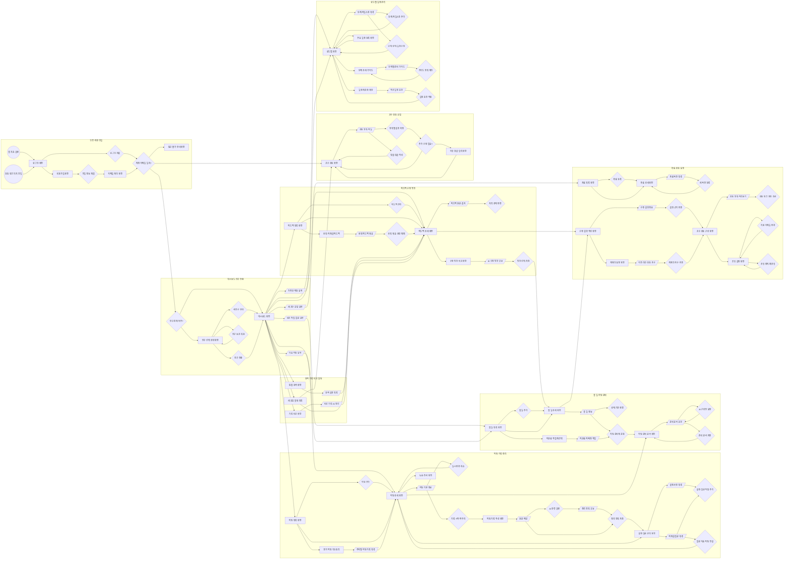

```mermaid
flowchart LR

  subgraph s1 ["인증·계정 진입"]
    n1(("앱 최초 실행"))
    n2(("검토 링크 터치 진입"))
    n3["로그인 화면"]
    n4{"로그인 제출"}
    n5["회원가입 화면"]
    n6{"가입 정보 제출"}
    n7["이메일 확인 화면"]
    n8{"계정 이메일 일치?"}
    n9["접근 불가 안내 화면"]
  end

  subgraph s2 ["대시보드·연구 전환"]
    n10{"연구 존재 여부?"}
    n11["연구 선택·생성 화면"]
    n12{"새 연구 생성"}
    n13{"연구 전환"}
    n14{"연구 보관·복원"}
    n15["대시보드 화면"]
    n16[/"다음 미팅 요약"/]
    n17[/"남은 작업·질문 요약"/]
    n18[/"새 교수 응답 요약"/]
    n19[/"가까운 마감 요약"/]
  end

  subgraph s3 ["미팅 기록·정리"]
    n20["미팅 목록 화면"]
    n21{"미팅 추가"}
    n22["미팅 상세 화면"]
    n23[/"미팅 기본 정보"/]
    n24{"일시 변경·취소"}
    n25{"기록 시작·마무리"}
    n26["미팅 기록 작성 화면"]
    n27[/"원문 메모"/]
    n28{"AI 분류 실행"}
    n29[/"정리 항목 후보"/]
    n30{"정리 항목 저장"}
    n31["결정·질문 관리 화면"]
    n32[/"결정 사항 목록"/]
    n33[/"미해결 질문 목록"/]
    n34{"결정·질문 직접 추가"}
    n35{"질문 다음 미팅 연결"}
    n36["과거 미팅 히스토리"]
    n37[/"주차별 미팅 기록 목록"/]
    n38["녹음·전사 화면"]
  end

  subgraph s4 ["피드백·수정 방안"]
    n39["피드백 목록 화면"]
    n40{"피드백 추가"}
    n41["피드백 상세 화면"]
    n42[/"피드백 원문·출처"/]
    n43{"처리 상태 변경"}
    n44["수정 방안 비교 화면"]
    n45[/"AI 수정 방안 후보"/]
    n46{"방안 선택·저장"}
    n47["반복·미해결 피드백"]
    n48[/"반복 피드백 묶음"/]
    n49{"반복 묶음 생성·해제"}
  end

  subgraph s5 ["할 일·미팅 준비"]
    n50["할 일 목록 화면"]
    n51{"할 일 추가"}
    n52["할 일 상세 화면"]
    n53[/"할 일 정보"/]
    n54{"상태·기한 변경"}
    n55{"미팅 준비에 포함"}
    n56["미완료 작업 재선택"]
    n57[/"미완료·미배정 작업"/]
    n58["미팅 준비 문서 화면"]
    n59[/"준비 문서 초안"/]
    n60{"AI 구성안 요청"}
    n61{"준비 문서 저장"}
  end

  subgraph s6 ["자료·검토 요청"]
    n62["자료 목록 화면"]
    n63{"자료 등록"}
    n64["자료 상세 화면"]
    n65[/"자료 버전 목록"/]
    n66{"새 버전 등록"}
    n67["수정 결과 작성 화면"]
    n68[/"수정 결과 정보"/]
    n69{"결과·근거 저장"}
    n70["교수 검토 구성 화면"]
    n71[/"검토 항목·미리보기"/]
    n72{"검토 링크 생성·복사"}
    n73["재확인 요청 화면"]
    n74[/"이전·최신 검토 차수"/]
    n75{"재확인 차수 저장"}
    n76["공유 설정 화면"]
    n77{"허용 이메일 변경"}
    n78{"공유 중지·재공유"}
  end

  subgraph s7 ["교수 검토·응답"]
    n79["교수 검토 화면"]
    n80[/"검토 항목·파일"/]
    n81{"항목별 결과 저장"}
    n82{"댓글·답글 작성"}
    n83{"추가 수정 필요?"}
    n84["이유 댓글 입력 화면"]
  end

  subgraph s8 ["로드맵·일정 관리"]
    n85["로드맵 화면"]
    n86[/"단계·마일스톤 목록"/]
    n87{"단계·마일스톤 추가"}
    n88{"단계 상태·일정 수정"}
    n89["단계 상세·가이드"]
    n90[/"단계별 준비 가이드"/]
    n91{"가이드 항목 확인"}
    n92["주요 일정 등록 화면"]
    n93["일정 재조정 제안"]
    n94[/"역산 일정 초안"/]
    n95{"일정 초안 적용"}
  end

  subgraph s9 ["검색·기록 비교·알림"]
    n96["통합 검색 화면"]
    n97[/"검색 결과 목록"/]
    n98["기록 비교 화면"]
    n99[/"비교 기록·AI 정리"/]
    n100["새 응답 알림 목록"]
  end

  n1 --> n3
  n2 --> n3
  n3 --> n4
  n3 --> n5
  n5 --> n6
  n6 --> n7
  n4 --> n8
  n7 --> n8
  n8 --> n10
  n8 --> n79
  n8 --> n9
  n10 --> n15
  n10 --> n11
  n11 --> n12
  n11 --> n13
  n11 --> n14
  n12 --> n15
  n13 --> n15
  n14 --> n11
  n15 --> n16
  n15 --> n17
  n15 --> n18
  n15 --> n19
  n16 --> n22
  n17 --> n50
  n18 --> n41
  n19 --> n85
  n15 --> n20
  n20 --> n21
  n21 --> n22
  n20 --> n22
  n22 --> n23
  n23 --> n24
  n23 --> n25
  n24 --> n22
  n25 --> n26
  n26 --> n27
  n27 --> n28
  n28 --> n29
  n29 --> n30
  n27 --> n30
  n30 --> n31
  n22 --> n31
  n31 --> n32
  n31 --> n33
  n32 --> n34
  n33 --> n34
  n33 --> n35
  n35 --> n22
  n20 --> n36
  n36 --> n37
  n37 --> n22
  n22 --> n38
  n15 --> n39
  n39 --> n40
  n40 --> n41
  n39 --> n41
  n41 --> n42
  n42 --> n43
  n41 --> n44
  n44 --> n45
  n45 --> n46
  n46 --> n52
  n39 --> n47
  n47 --> n48
  n48 --> n49
  n49 --> n41
  n15 --> n50
  n50 --> n51
  n51 --> n52
  n50 --> n52
  n52 --> n53
  n53 --> n54
  n53 --> n55
  n55 --> n58
  n50 --> n56
  n56 --> n57
  n57 --> n55
  n22 --> n58
  n58 --> n59
  n59 --> n60
  n59 --> n61
  n60 --> n59
  n61 --> n58
  n15 --> n62
  n62 --> n63
  n63 --> n64
  n62 --> n64
  n64 --> n65
  n65 --> n66
  n66 --> n64
  n41 --> n67
  n52 --> n67
  n67 --> n68
  n68 --> n69
  n69 --> n70
  n70 --> n71
  n71 --> n72
  n67 --> n73
  n73 --> n74
  n74 --> n75
  n75 --> n70
  n70 --> n76
  n76 --> n77
  n76 --> n78
  n77 --> n76
  n78 --> n76
  n79 --> n80
  n80 --> n81
  n81 --> n83
  n83 --> n84
  n83 --> n79
  n84 --> n79
  n80 --> n82
  n82 --> n79
  n15 --> n85
  n85 --> n86
  n86 --> n87
  n86 --> n88
  n87 --> n85
  n88 --> n85
  n85 --> n89
  n89 --> n90
  n90 --> n91
  n91 --> n89
  n85 --> n92
  n92 --> n85
  n85 --> n93
  n93 --> n94
  n94 --> n95
  n95 --> n85
  n15 --> n96
  n96 --> n97
  n97 --> n41
  n15 --> n98
  n98 --> n99
  n99 --> n41
  n15 --> n100
  n100 --> n41
  n100 --> n79
```
